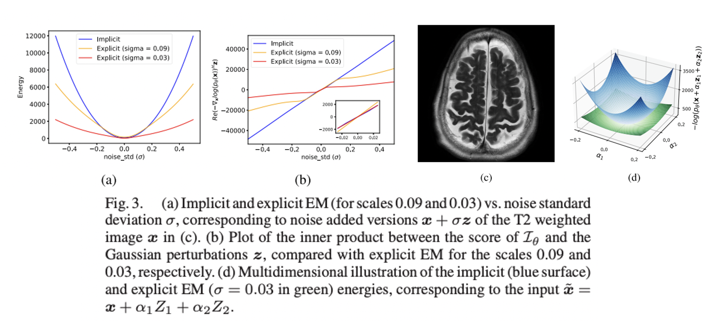
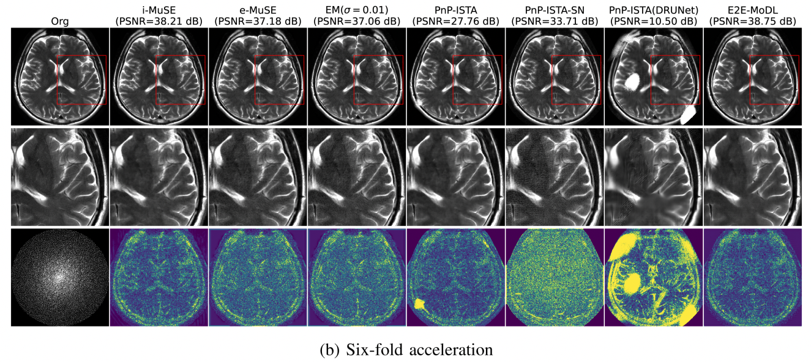

# [Multi-Scale Energy (MuSE) Framework for Inverse Problems in Imaging](https://ieeexplore.ieee.org/stamp/stamp.jsp?tp=&arnumber=10645311)

# About
We introduce multi-scale energy models to learn the prior distribution of images, which can be used in inverse problems
to derive the Maximum A Posteriori (MAP) estimate and to sample from the posterior distribution. 

Compared to the traditional single-scale energy models, the multi-scale strategy improves the estimation accuracy and convergence of the MAP algorithm, even when it is initialized far away from the solution. We propose two kinds of multi-scale strategies: 

1. Explicit (e-MuSE) framework - where we use a sequence of explicit energies, each corresponding to a smooth approximation of the original negative log-prior
2. Implicit (i-MuSE) - where we rely on a single energy function whose gradients at different scales closely match the corresponding e-MuSE gradients. 

Although both schemes improve convergence and accuracy, the e-MuSE MAP solution depends on the scheduling strategy, including the choice of intermediate scales and exit conditions. In contrast, the i-MuSE formulation is significantly simpler,
resulting in faster convergence and improved performance. We compare the performance of the proposed MuSE models in the context of Magnetic Resonance (MR) image recovery. The results demonstrate that the multi-scale framework yields a MAP reconstruction comparable in quality to the End-to-End (E2E) trained models, while being relatively unaffected by the changes in the forward model.

## Visualization of the implicit and explicit energy functions
Energy of an image is the distance of the image from the data manifold as shown below:

# Results

# Pretrained checkpoint
1. i-MuSE checkpoints can be found here [Google drive](https://drive.google.com/drive/folders/1ebMu5_oeHdpaSaS5Pf6GkdqYMnGxwcQl?usp=sharing)
2. Create a new folder named "Models" inside the MuSE folder.
3. Copy the downloaded file "net100.pt" and paste it inside the "Models" folder. 

# Instructions to download example data
1. Download the example data from here [Google drive](https://drive.google.com/drive/folders/1qR4q3a9usZgWdV5u2CkwaHe2tITug3XE?usp=sharing) 
2. Create a new folder named "Example_data" inside the MuSE folder. 
3. Copy the downloaded  folder "T2_big_pickle" and paste it inside the "Example_data" folder.

# Jupyter Notebook
Run the jupyter notebook "test.ipynb" to replicate results.

# Paper 
J. R. Chand and M. Jacob, "Multi-Scale Energy (MuSE) Framework for Inverse Problems in Imaging," IEEE Transactions on Computational Imaging, vol. 10, pp. 1250-1265, 2024, doi: 10.1109/TCI.2024.3449101 ([link](https://ieeexplore.ieee.org/stamp/stamp.jsp?tp=&arnumber=10645311))
